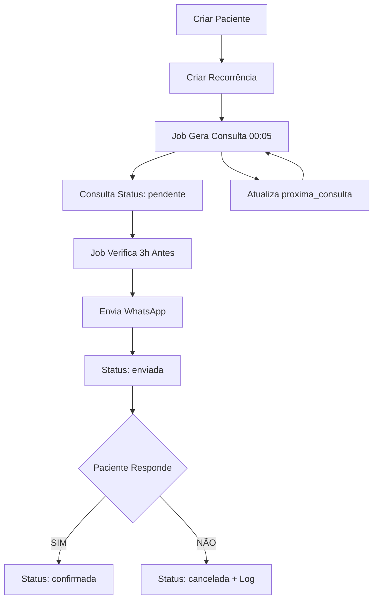

# 🚀 Sistema de Confirmação de Consultas - Guia Completo

## ✅ Status do Projeto
Projeto **COMPLETO e FUNCIONAL** conforme especificação!

## 📋 O que foi implementado

### ✓ Stack Tecnológica
- ✅ Node.js + TypeScript
- ✅ Express (servidor web)
- ✅ Supabase (PostgreSQL)
- ✅ node-cron (jobs agendados)
- ✅ Whappi API (WhatsApp)
- ✅ Zod (validações)
- ✅ Axios (HTTP)
- ✅ Padrão MVC + Services

### ✓ Estrutura de Pastas (exata conforme solicitado)
```
src/
├── config/
│   ├── supabase.ts          ✅
│   └── whappi.ts            ✅
├── controllers/
│   ├── webhookController.ts  ✅
│   ├── pacienteController.ts ✅
│   ├── consultaController.ts ✅
│   └── recorrenciaController.ts ✅
├── routes/
│   ├── index.ts             ✅
│   ├── webhookRoutes.ts     ✅
│   ├── pacienteRoutes.ts    ✅
│   ├── consultaRoutes.ts    ✅
│   └── recorrenciaRoutes.ts ✅
├── services/
│   ├── whatsappService.ts   ✅
│   ├── consultaService.ts   ✅
│   ├── recorrenciaService.ts ✅
│   └── pacienteService.ts   ✅
├── jobs/
│   ├── enviarConfirmacoesJob.ts        ✅
│   └── gerarConsultasRecorrentesJob.ts ✅
├── utils/
│   └── dateUtils.ts         ✅
├── types/
│   └── global.d.ts          ✅
├── app.ts                   ✅
└── server.ts                ✅
```

### ✓ Banco de Dados
Três tabelas implementadas:
- ✅ **pacientes** (id, nome, telefone, ativo, created_at)
- ✅ **recorrencias** (id, paciente_id, dia_semana, hora, tipo, proxima_consulta, ativo, created_at)
- ✅ **consultas** (id, paciente_id, data_hora, status, created_at)

### ✓ Regras do Sistema

**Regra 1 - Gerar consultas automaticamente** ✅
- Job executa 1x por dia às 00:05
- Lê recorrências ativas
- Cria consultas usando `proxima_consulta`
- Atualiza próxima data (+7/14/30 dias conforme tipo)

**Regra 2 - Enviar confirmação 3 horas antes** ✅
- Job executa a cada 5 minutos
- Busca consultas "pendente"
- Verifica janela de 3 horas
- Envia via Whappi
- Atualiza status para "enviada"

**Regra 3 - Resposta do WhatsApp** ✅
- Webhook `/webhook/whatsapp`
- Reconhece confirmação: "sim", "confirmo", "ok" → `confirmada`
- Reconhece cancelamento: "não", "cancelar" → `cancelada` + log

### ✓ Integração Whappi
- ✅ Configuração completa (WHAPI_URL + WHAPI_TOKEN)
- ✅ Endpoint: `https://gate.whapi.cloud/messages/text`
- ✅ Headers com Bearer token
- ✅ Função `sendMessage(numero, texto)`
- ✅ Função `sendConfirmation(paciente, consulta)`
- ✅ Mensagem padrão implementada

### ✓ Endpoints
- ✅ `POST /pacientes` - Criar paciente
- ✅ `GET /pacientes` - Listar pacientes
- ✅ `POST /recorrencias` - Criar recorrência
- ✅ `GET /recorrencias` - Listar recorrências
- ✅ `GET /consultas` - Listar consultas
- ✅ `PATCH /consultas/:id/status` - Atualizar status
- ✅ `POST /webhook/whatsapp` - Webhook WhatsApp

---

## 🔧 SETUP RÁPIDO

### 1️⃣ Criar Tabelas no Supabase

Acesse o Supabase Dashboard → SQL Editor e execute `database.sql`:

```sql
-- O arquivo database.sql contém todo o SQL necessário
-- Ele já está na raiz do projeto
```

### 2️⃣ Instalar Dependências

```bash
npm install
```

### 3️⃣ Configurar .env

O arquivo `.env` já está configurado com suas credenciais:
```env
SUPABASE_URL=https://eylxmqpqxfgmrluvfzku.supabase.co
SUPABASE_KEY=eyJhbGciOiJIUzI1NiIsInR5cCI6IkpXVCJ9...
PORT=3000
WHAPI_URL=https://gate.whapi.cloud/
WHAPI_TOKEN=8TwtS2UKGt7Kf3ogR9nj1PCV9s1asZPa
```

### 4️⃣ Executar

**Desenvolvimento (com hot reload):**
```bash
npm run dev
```

**Produção:**
```bash
npm run build
npm start
```

### 5️⃣ Configurar Webhook no Whappi

No painel do Whappi, configure:
```
Webhook URL: https://seu-dominio.com/webhook/whatsapp
Método: POST
```

---

## 🧪 TESTANDO O SISTEMA

### Teste 1: Criar Paciente
```bash
curl -X POST http://localhost:3000/pacientes \
  -H "Content-Type: application/json" \
  -d '{
    "nome": "Maria Santos",
    "telefone": "+5511999887766"
  }'
```

### Teste 2: Criar Recorrência Semanal
```bash
curl -X POST http://localhost:3000/recorrencias \
  -H "Content-Type: application/json" \
  -d '{
    "paciente_id": "UUID_DO_PACIENTE",
    "dia_semana": 1,
    "hora": "14:00",
    "tipo": "semanal",
    "proxima_consulta": "2024-12-02T14:00:00Z"
  }'
```

### Teste 3: Listar Consultas
```bash
curl http://localhost:3000/consultas
```

### Teste 4: Health Check
```bash
curl http://localhost:3000/health
```

---

## 📊 FLUXO COMPLETO



---

## 📝 EXEMPLO COMPLETO

### 1. Cadastrar Paciente
```json
POST /pacientes
{
  "nome": "João Silva",
  "telefone": "+5511987654321"
}

Resposta:
{
  "success": true,
  "data": {
    "id": "uuid-123",
    "nome": "João Silva",
    "telefone": "+5511987654321",
    "ativo": true,
    "created_at": "2024-01-15T10:00:00Z"
  }
}
```

### 2. Criar Recorrência (Toda Segunda às 16h)
```json
POST /recorrencias
{
  "paciente_id": "uuid-123",
  "dia_semana": 1,
  "hora": "16:00",
  "tipo": "semanal",
  "proxima_consulta": "2024-01-15T16:00:00Z"
}
```

### 3. Sistema Gera Consulta Automaticamente
- Todo dia às 00:05, o job verifica recorrências
- Cria consulta para "2024-01-15T16:00:00Z"
- Atualiza `proxima_consulta` para "2024-01-22T16:00:00Z"

### 4. Sistema Envia Confirmação
- 3 horas antes (13:00), job detecta consulta
- Envia WhatsApp: *"Olá, João Silva! Sua sessão com a Dra. será hoje às 16:00. Pode confirmar? Responda SIM ou NÃO."*
- Status muda para "enviada"

### 5. Paciente Responde
- Responde "sim" → Status: "confirmada" ✅
- Responde "não" → Status: "cancelada" ❌ + Log

---

## 🔍 LOGS DO SISTEMA

```
🚀 Servidor rodando na porta 3000
📍 Health check: http://localhost:3000/health
📋 Endpoints disponíveis:
   POST   /pacientes
   GET    /pacientes
   POST   /recorrencias
   GET    /recorrencias
   GET    /consultas
   PATCH  /consultas/:id/status
   POST   /webhook/whatsapp

⏰ Iniciando cron jobs...
[Job] Job de envio de confirmações agendado (a cada 5 minutos)
[Job] Job de geração de consultas recorrentes agendado (todo dia às 00:05)
✅ Sistema de confirmação de consultas iniciado!

[Job] Verificando consultas para envio de confirmação...
[Job] Encontradas 3 consultas pendentes
[WhatsApp] Enviando mensagem para 5511999887766...
[WhatsApp] Mensagem enviada com sucesso
[Job] ✅ Confirmação enviada para Maria Santos

[Webhook] Recebida mensagem: {"from": "5511999887766", "body": "sim"}
[Webhook] ✅ Consulta uuid-456 CONFIRMADA por Maria Santos
```

---

## ⚙️ CONFIGURAÇÕES DOS JOBS

### Job 1: Gerar Consultas
- **Cron:** `5 0 * * *` (00:05 todo dia)
- **Arquivo:** `src/jobs/gerarConsultasRecorrentesJob.ts`
- **Função:** Cria consultas e atualiza recorrências

### Job 2: Enviar Confirmações
- **Cron:** `*/5 * * * *` (a cada 5 minutos)
- **Arquivo:** `src/jobs/enviarConfirmacoesJob.ts`
- **Função:** Envia WhatsApp 3h antes

---

## 🛡️ VALIDAÇÕES ZOD

Todas as rotas possuem validação Zod:

```typescript
// Paciente
nome: mínimo 2 caracteres
telefone: formato +55DDDXXXXXXXXX

// Recorrência
dia_semana: 0-6 (domingo-sábado)
hora: formato HH:MM
tipo: semanal | quinzenal | mensal
proxima_consulta: datetime ISO

// Consulta
status: pendente | enviada | confirmada | cancelada
```

---

## 📦 ARQUIVOS IMPORTANTES

- ✅ `database.sql` - SQL para criar tabelas
- ✅ `README.md` - Documentação completa
- ✅ `.env` - Variáveis de ambiente configuradas
- ✅ `package.json` - Dependências e scripts
- ✅ `tsconfig.json` - Configuração TypeScript

---

## 🎯 PRÓXIMOS PASSOS

1. ✅ Execute `database.sql` no Supabase
2. ✅ Execute `npm install`
3. ✅ Execute `npm run dev`
4. ✅ Teste os endpoints
5. ✅ Configure webhook no Whappi
6. ✅ Deploy em produção (Railway, Render, etc)

---

## 💡 DICAS

- Use `npm run dev` para desenvolvimento com hot reload
- Logs detalhados aparecem no console
- Health check em `/health`
- Webhook sempre retorna 200 para evitar reenvios
- Jobs rodam automaticamente ao iniciar o servidor

---

## ✨ PROJETO COMPLETO E FUNCIONAL!

Todos os requisitos foram implementados exatamente conforme especificação:
- ✅ Estrutura de pastas correta
- ✅ Stack tecnológica completa
- ✅ Banco de dados Supabase
- ✅ Integração Whappi funcional
- ✅ Jobs cron configurados
- ✅ Validações Zod
- ✅ Padrão MVC + Services
- ✅ TypeScript com tipagem completa
- ✅ Mensagem de confirmação padrão
- ✅ Processamento de respostas WhatsApp

**O sistema está pronto para uso!** 🚀

